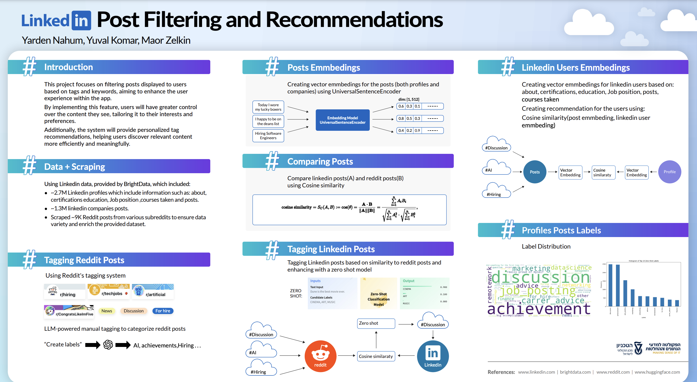

# LinkedIn Post Filtering and Recommendation System  


## 📌 Project Overview  
This project introduces an AI-driven filtering feature for LinkedIn posts, classifying them into three distinct labels. Users can personalize their feeds by selecting preferred topics while excluding unwanted content. Additionally, our system analyzes LinkedIn user profiles to suggest the most relevant posts based on their professional interests.  

## 🎯 Motivation  
LinkedIn feeds can become cluttered with diverse content, from job postings and career achievements to general discussions and personal experiences. Our primary use case is job hunting, so we aimed to develop a filtering system that prioritizes job-related posts, enhancing user experience and making feeds more relevant.  

## 📊 Data Collection & Integration  
- **LinkedIn Data**: Sourced from BrightData, including company posts and user profiles (about section, certifications, education, job positions, authored posts, and courses).  
- **Reddit Data**: Scraped 19,925 posts using Selenium, cleaned to 8,726 posts from 11 subreddits (e.g., AI, Career Advice, Job Posting).  
- **Integration**: We linked LinkedIn posts with the most similar Reddit posts using cosine similarity, leveraging subreddit topics for classification.  

## 🤖 AI Methodologies  
1. **Reddit Post Tagging**: Used subreddit categories, pre-existing post labels, and a word detection dictionary (expanded with ChatGPT).  
2. **Embedding & Similarity Matching**: Applied `UniversalSentenceEncoder` to embed posts and calculated cosine similarity to assign labels.  
3. **Refining Labels**: Used `DeBERTa-Zero-Shot-Classification` to refine post labels, selecting the most relevant three.  
4. **User-Post Recommendations**: Created user embeddings from profile data and matched them with post embeddings to recommend the most relevant content.  

## 📂 Project Structure  
```plaintext
📦 LinkedIn-Post-Filtering  
├── 📂 scripts/                  # Python scripts for data scraping
├── 📜 Project.ipynb             # Main Jupyter Notebook  
└── 📜 README.md                 # Project documentation  
```  

## 🚀 Installation & Usage  
### 1️⃣ Clone the Repository  
```bash
git clone https://github.com/yarden077/LinkedIn-Post-Filtering.git  
cd LinkedIn-Post-Filtering  
```
### 2️⃣ Run the Jupyter Notebook  
```bash
jupyter notebook Project.ipynb  
```  

## 👥 Contributors  
- **Maor ZLk** - [[GitHub Profile](https://github.com/MaorZLk)]
- **Yuval Komar** - [[GitHub Profile](https://github.com/yuvalkomar)]
- **Yarden Nahum** - [[GitHub Profile](https://github.com/yarden077)]
  
## 📜 References  

- [LinkedIn](https://www.linkedin.com/)  
- [Spark NLP](https://sparknlp.org/2020/04/17/tfhub_use.html)
- [ChatGPT](https://chatgpt.com)   
- [Cosine Similarity](https://en.wikipedia.org/wiki/Cosine_similarity)  
- [Hugging Face DeBERTa](https://huggingface.co/DeBERTa-Zero-Shot-Classification)  
